İLAÇ TARİF'e reçete aktarımı
============================

Bu dökümantasyon İlaç Tarif uygulamasına nasıl reçete aktarabileceğinizi
anlatır.

Reçete aktarımla İlaç Tarif uygulamasına argüman göndererek gerçekleşir.

İki farklı veri aktarımı mevcuttur:

# 1. Reçete aktarımı  

    "C:\Program Files\ALTERNET\Medicine\Medicine.exe" api.prescription={json}  

### 1.1 Jsonda (Reçetede) bulunabilecek bütün değerler

``` json
{
  "SenderApplication": "Reçeteyi gönderen uygulama",
  "DoctorName": "Doktor Ad",
  "DoctorSurname": "Doktor Soyad",
  "Drugs": [
    {
      "Barcodes": [
        "123412341",
        "123412342",
        "123412343"
      ],
      "Difference": 0.0,
      "Dosage1": 1,
      "Dosage2": 5.0,
      "EndDate": "21/02/2018",
      "Message": "1b.3d",
      "Name": "NEXIUM 40 MG.28 TABLET",
      "Period1": 1,
      "Period2": 3,
      "Price": 50.0,
      "Quantity": 1,
      "Report": "04.03"
    }
  ],
  "Name": "Hasta Adi",
  "PrescriptionNo": "1b2b3b4",
  "Surname": "Hasta Soyadi",
  "Tc": "12345678901"
}
```

Olmayan bilgileri `null`, `""` olarak gönderebilir veya o fieldi hiç jsona eklemeden de gönderebilirsiniz.

Örnek Json

``` json
{
  "DoctorName": "",
  "DoctorSurname": null,
  "Drugs": [
    {
      "Barcodes": [
        "123412341"
      ]
    },
    {
      "Barcodes": [
        "123412395"
      ]
    }
  ]
}
```


# 2. Property Listesi

-   **Name**: Hastanın Adı  
    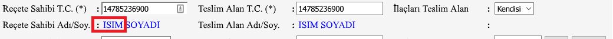  
-   **Surname** Hastanın Soyadı 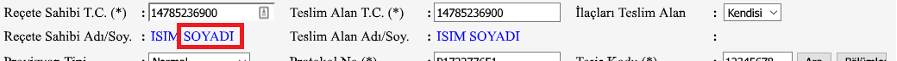
-   **PrescriptionNo** Reçete Numarası  
    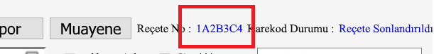  
-   **Tc** Hastanın Tc Numarası  
    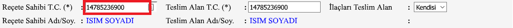  
-   **DoctorName** Reçete üzerinde olan doktorun adı  
    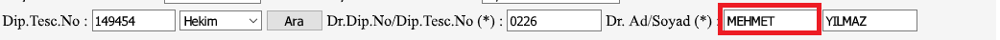  
-   **DoctorSurname** Doktorun soyadı  
    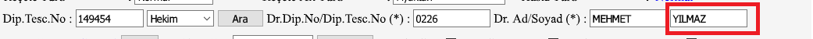  

-   **Drugs**: İlaçların bilgileri
    -   **Barcodes** İlacın barkod listesi
    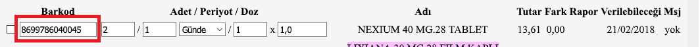
    -   **Quantity**
    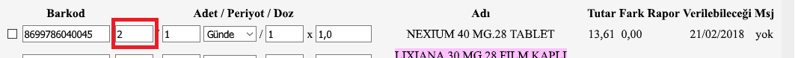
    -   **Period1**
    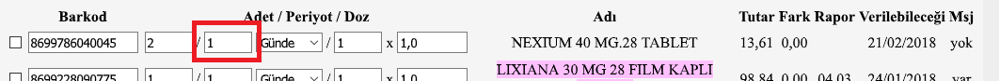
    -   **Period2**
    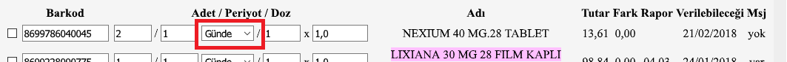
    -   **Dosage1**
    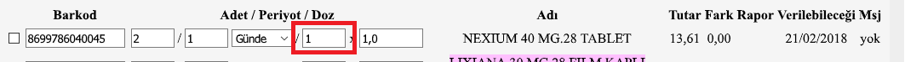
    -   **Dosage2**
    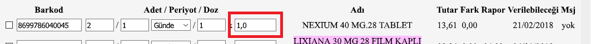
    -   **Name**
    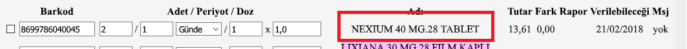
    -   **Price**
    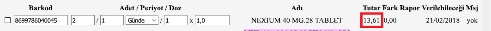  
    -   **Difference**
    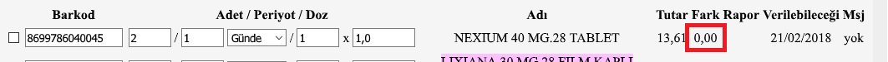  
    -   **Report**
    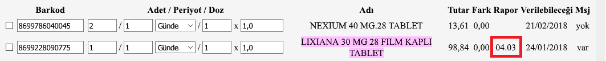
    -   **EndDate**
    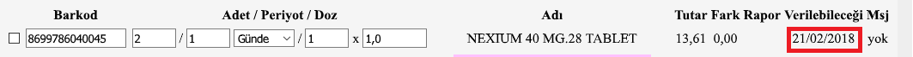
    -   **Message**
    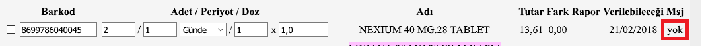
-   **PrescriptionAmount**: Reçete Fiyat Bilgileri
    ----------------------------------------------

    -   **PrescriptionContribution\_Hand**
    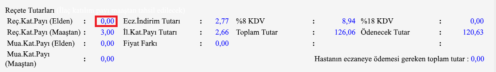
    -   **PrescriptionContribution\_Salary**
    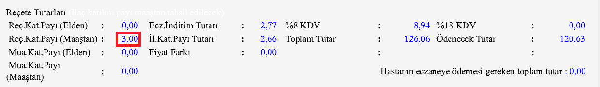
    -   **ExaminationContribution\_Hand**
    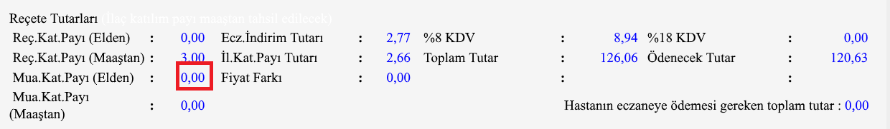
    -   **ExaminationContribution\_Salary**
    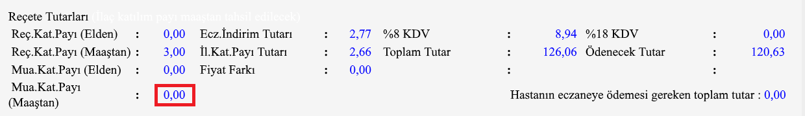
    -   **PharmacyDiscountAmount**
    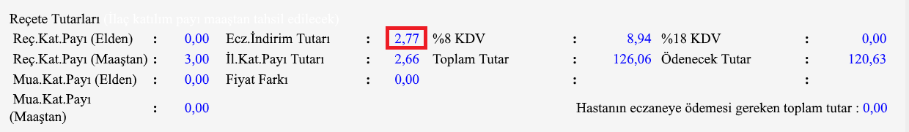
    -   **DrugContribution**
    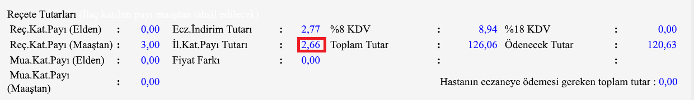
    -   **PriceDifference**
    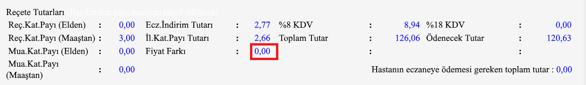
    -   **Tax8**
    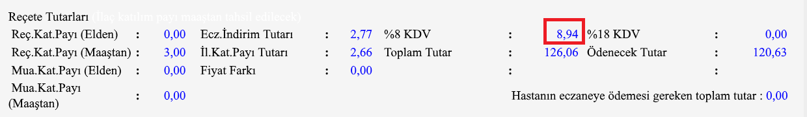
    -   **Tax18**
    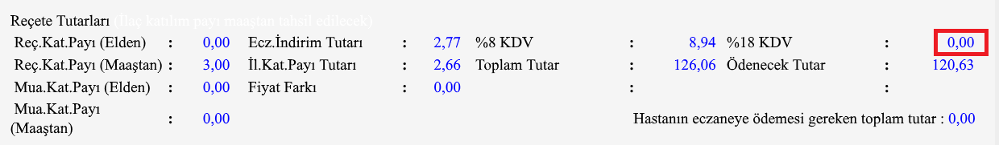
    -   **TotalPrice**
    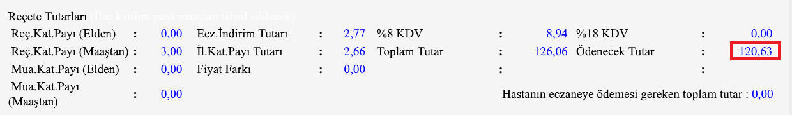
    -   **TotalAmountDueToPharmacy**
    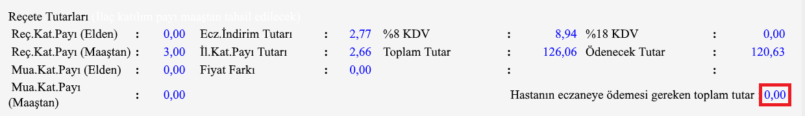


# 3. `MedicineHelper` Sınıfı

`MedicineHelper` sınıfı İlaç Tarif uygulamasına reçete ve elden ilaç listesi aktarırken kullanılır.

## 3.1 `MedicineHelper` sınıfı ile reçete aktarımı

``` C#
Prescription prescription = new Prescription();
...
//Gerekli reçete bilgilerini doldurunuz.

IJsonSerializer serializer = new JsonSerializer();
MedicineHelper helper = new MedicineHelper(jsonSerializer);
helper.Send(prescription);
```

### Newtonsoft.Json ile JsonSerializer sınıfı örneği

``` C#
public class JsonSerializer : IJsonSerializer {
    public string ToJson(object o) {
        return Newtonsoft.Json.JsonConvert.SerializeObject(o);
    }
}
````
