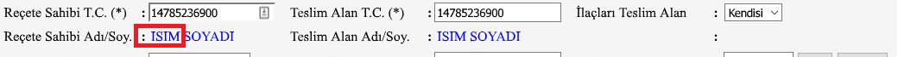
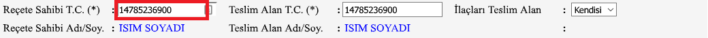
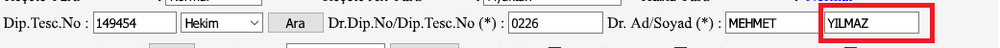
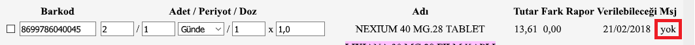
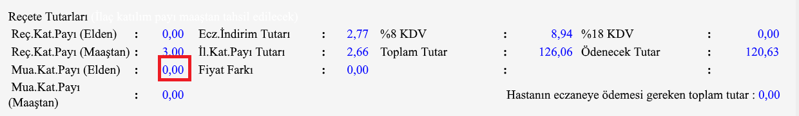
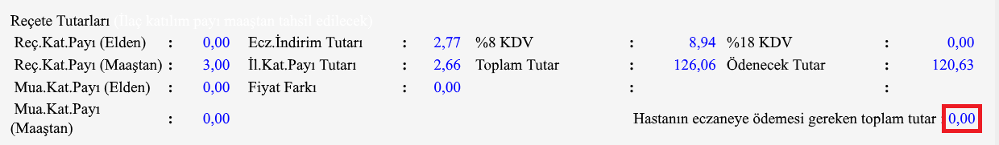

### Son değişiklikler

1.  Fiyat etiketi bilgilerinin girilebileği `Amount` propertysi eklenmiştir.
2.  `"` işareti bazı bilgisayarlarda sorun oluşturduğu için json Base64e çevrilip gönderilmeye başlanmıştır.

ilaçtarif®'e veri aktarımı
==========================

Bu dökümantasyon ilaçtarif® uygulamasına nasıl veri aktarabileceğinizi
anlatır.

Veri aktarımı ilaçtarif® uygulamasına argüman göndererek gerçekleşir.

`Json` dosyasını kendi yöntemleriniz ile veya bizim hazırladığımız
sınıflar yardımı ile oluşturabilirsiniz.

1. Veri aktarımı genel yapısı
=============================

    "C:\Program Files\ALTERNET\Medicine\Medicine.exe" api.prescription=Base64({json})  

### 1.1 Jsonda bulunabilecek bütün değerler

``` json
{
  "Amount": {
    "DrugContribution": 2.1,
    "ExaminationContribution_Hand": 0.0,
    "ExaminationContribution_Salary": 59.0,
    "PharmacyDiscountAmount": 1.92,
    "PrescriptionContribution_Hand": 0.0,
    "PrescriptionContribution_Salary": 3.0,
    "PriceDifference": 0.0,
    "Tax18": 0.0,
    "Tax8": 0.0,
    "TotalAmountDueToPharmacy": 10.0,
    "TotalPrice": 40.0
  },
  "DoctorName": "Doktor Ad",
  "DoctorSurname": "Doctor Soyad",
  "Drugs": [
    {
      "Barcodes": [
        "8699546031870"
      ],
      "Difference": 0.0,
      "Dosage1": 1,
      "Dosage2": 2.5,
      "EndDate": "13/01/2018",
      "Message": "yok",
      "Name": "ILAC ADI",
      "Period1": 1,
      "Period2": 0,
      "Price": 15.0,
      "Quantity": 10,
      "Report": "91.24"
    },
    {
      "Barcodes": [
        "8699546032297"
      ],
      "Difference": null,
      "Dosage1": 0,
      "Dosage2": 0.0,
      "EndDate": null,
      "Message": null,
      "Name": null,
      "Period1": 0,
      "Period2": 0,
      "Price": null,
      "Quantity": 0,
      "Report": null
    }
  ],
  "Name": "Hasta Ad",
  "PrescriptionNo": "Recete No",
  "SenderApplication": "Demo Otomasyon Uygulamasi",
  "Surname": "Hasta Soyad",
  "Tc": "hasta tc"
}
```

Olmayan bilgileri `null`, `""` olarak gönderebilir veya o fieldi hiç
jsona eklemeden de gönderebilirsiniz.

### Örnek Json

``` json
{
  "DoctorName": "",
  "DoctorSurname": null,
  "Drugs": [
    {
      "Barcodes": [
        "123412341"
      ]
    },
    {
      "Barcodes": [
        "123412395"
      ]
    }
  ]
}
```

#### NOT 1: Veri gönderme aşamasında bir ilacın oluşabilmesi için en az 1 barkod numarası göndermek zorunludur.

#### NOT 2:Jsonu normal olarak gönderirken bazı bilgisayarlarda `"` işaretlerinde sorun olduğu için `Base64`\`e çevirdikten sonra gönderilmeye başlanmıştır.

    public static string Base64Encode(string text) {
        byte[] plainTextBytes = System.Text.Encoding.UTF8.GetBytes(text);
        return System.Convert.ToBase64String(plainTextBytes);
    }

### Örnek Kullanım

    "C:\Program Files\ALTERNET\Medicine\Medicine.exe" "api.prescription=eyJQcmVzY3JpcHRpb25ObyI6IlJlY2V0ZSBObyIsIkRydWdzIjpbeyJOYW1lIjoiSUxBQyBBREkiLCJSZXBvcnQiOiI5MS4yNCIsIlByaWNlIjoxNS4wLCJEaWZmZXJlbmNlIjowLjAsIkVuZERhdGUiOiIxMy8wMS8yMDE4IiwiTWVzc2FnZSI6InlvayIsIlF1YW50aXR5IjoxMCwiQmFyY29kZXMiOlsiODY5OTU0NjAzMTg3MCJdLCJQZXJpb2QxIjoxLCJQZXJpb2QyIjowLCJEb3NhZ2UxIjoxLCJEb3NhZ2UyIjoyLjV9LHsiTmFtZSI6bnVsbCwiUmVwb3J0IjpudWxsLCJQcmljZSI6bnVsbCwiRGlmZmVyZW5jZSI6bnVsbCwiRW5kRGF0ZSI6bnVsbCwiTWVzc2FnZSI6bnVsbCwiUXVhbnRpdHkiOjAsIkJhcmNvZGVzIjpbIjg2OTk1NDYwMzIyOTciXSwiUGVyaW9kMSI6MCwiUGVyaW9kMiI6MCwiRG9zYWdlMSI6MCwiRG9zYWdlMiI6MC4wfV0sIkRvY3Rvck5hbWUiOiJEb2t0b3IgQWQiLCJEb2N0b3JTdXJuYW1lIjoiRG9jdG9yIFNveWFkIiwiTmFtZSI6Ikhhc3RhIEFkIiwiU3VybmFtZSI6Ikhhc3RhIFNveWFkIiwiVGMiOiJoYXN0YSB0YyIsIlNlbmRlckFwcGxpY2F0aW9uIjoiRGVtbyBPdG9tYXN5b24gVXlndWxhbWFzaSIsIkFtb3VudCI6eyJQcmVzY3JpcHRpb25Db250cmlidXRpb25fSGFuZCI6MC4wLCJQcmVzY3JpcHRpb25Db250cmlidXRpb25fU2FsYXJ5IjozLjAsIkV4YW1pbmF0aW9uQ29udHJpYnV0aW9uX0hhbmQiOjAuMCwiRXhhbWluYXRpb25Db250cmlidXRpb25fU2FsYXJ5Ijo1OS4wLCJQaGFybWFjeURpc2NvdW50QW1vdW50IjoxLjkyLCJEcnVnQ29udHJpYnV0aW9uIjoyLjEsIlByaWNlRGlmZmVyZW5jZSI6MC4wLCJUYXg4IjowLjAsIlRheDE4IjowLjAsIlRvdGFsUHJpY2UiOjQwLjAsIlRvdGFsQW1vdW50RHVlVG9QaGFybWFjeSI6MTAuMH19"

2. `MedicineHelper` Sınıfı
==========================

`MedicineHelper` sınıfı ilaçtarif® uygulamasına reçete ve elden ilaç
listesi aktarırken kullanılır.

2.1 `MedicineHelper` sınıfı ile veri aktarımı
---------------------------------------------

Demo uygulama [Program.cs](/ConsoleApp1/Program.cs)

``` c#
Prescription prescription = new Prescription();
prescription.DoctorName = "Doktor Ad";
prescription.DoctorSurname = "Doctor Soyad";
prescription.Name = "Hasta Ad";
prescription.Surname = "Hasta Soyad";
prescription.PrescriptionNo = "Recete No";
prescription.Tc = "hasta tc";
prescription.SenderApplication = "Demo Otomasyon Uygulamasi";
prescription.Drugs = new List<Drug> {
    new Drug {
        Barcodes = new List<string> {
            "123412341"
        },
        Name = "ILAC ADI",
        Report = "91.24",
        Price = 15,
        Difference = 0,
        EndDate = "13/13/2323",
        Message = "yok",
        Dosage1 = 1,
        Dosage2 = 2.5F,
        Period1 = 1,
        Period2 = PeriodTypes.Gunde,
        Quantity = 1
    },
    new Drug {
        Barcodes = new List<string> {
            "123412341"
        }
    }
//Örnek fiyat etiketi
prescription.Amount = new PrescriptionAmount();
prescription.Amount.DrugContribution = 2.1F;
prescription.Amount.ExaminationContribution_Hand = 0;
prescription.Amount.ExaminationContribution_Salary = 59;
prescription.Amount.PrescriptionContribution_Hand = 0;
prescription.Amount.PrescriptionContribution_Salary = 3;
prescription.Amount.PharmacyDiscountAmount = 1.92F;
prescription.Amount.PriceDifference = 0;
prescription.Amount.Tax18 = 0;
prescription.Amount.Tax8 = 0;
prescription.Amount.TotalPrice = 40;
prescription.Amount.TotalAmountDueToPharmacy = 10;

IJsonSerializer serializer = new JsonSerializer();
MedicineHelper helper = new MedicineHelper(serializer);
helper.Send(prescription);
```

### Newtonsoft.Json ile JsonSerializer sınıfı örneği

[https://github.com/ilactarif/medicine.desktop.api/blob/e102624cd3d18e70ef76ded24318e22028cb67da/ConsoleApp1/Program.cs\\\#L32-L36](https://github.com/ilactarif/medicine.desktop.api/blob/e102624cd3d18e70ef76ded24318e22028cb67da/ConsoleApp1/Program.cs#L32-L36)

``` c#
public class JsonSerializer : IJsonSerializer {
    public string ToJson(object o) {
        return Newtonsoft.Json.JsonConvert.SerializeObject(o);
    }
}
```

3. Property Listesi
===================

-   **Name**: Hastanın Adı
      
-   **Surname** Hastanın Soyadı
    
-   **PrescriptionNo** Reçete Numarası
      
-   **Tc** Hastanın Tc Numarası
      
-   **DoctorName** Reçete üzerinde olan doktorun adı
      
-   **DoctorSurname** Doktorun soyadı
      

-   **Drugs**: İlaçların bilgileri
    -   **Barcodes** İlacın barkod listesi
        
    -   **Quantity** 
    -   **Period1** 
    -   **Period2** 
    -   **Dosage1** 
    -   **Dosage2** 
    -   **Name** 
    -   **Price** 
    -   **Difference**
        
    -   **Report** 
    -   **EndDate** 
    -   **Message** 
-   **PrescriptionAmount**: Reçete Fiyat Bilgileri
    ----------------------------------------------

    -   **PrescriptionContribution\_Hand**
        
    -   **PrescriptionContribution\_Salary**
        
    -   **ExaminationContribution\_Hand**
        
    -   **ExaminationContribution\_Salary**
        
    -   **PharmacyDiscountAmount**
        
    -   **DrugContribution**
        
    -   **PriceDifference**
        
    -   **Tax8** 
    -   **Tax18** 
    -   **TotalPrice** 
    -   **TotalAmountDueToPharmacy**
        


